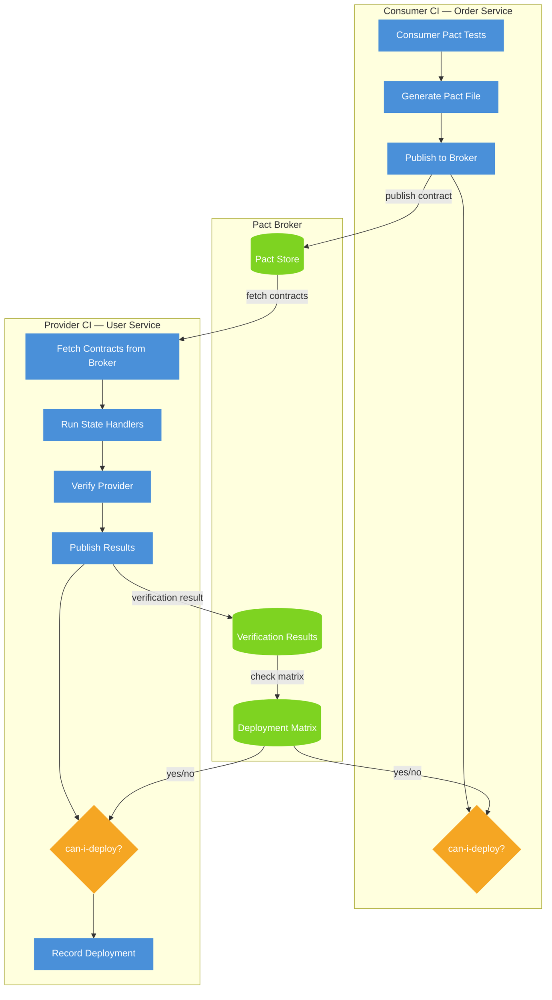
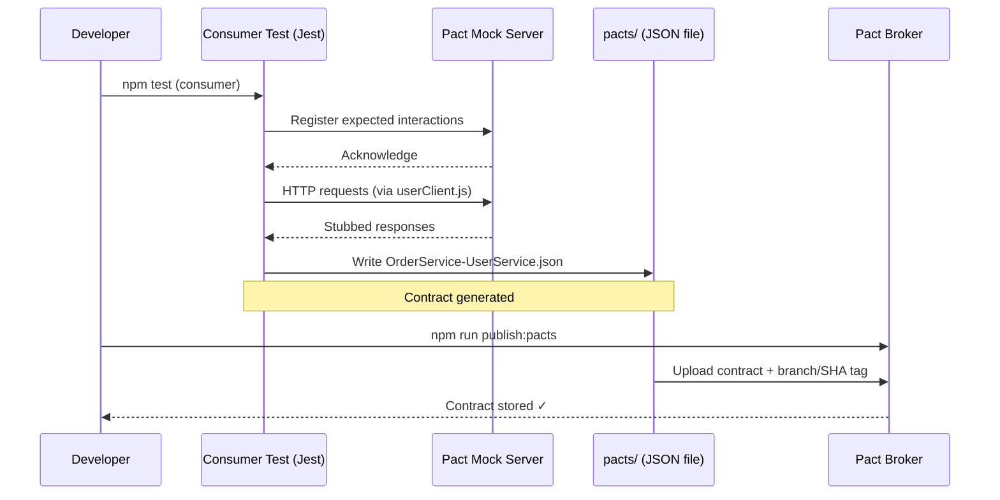
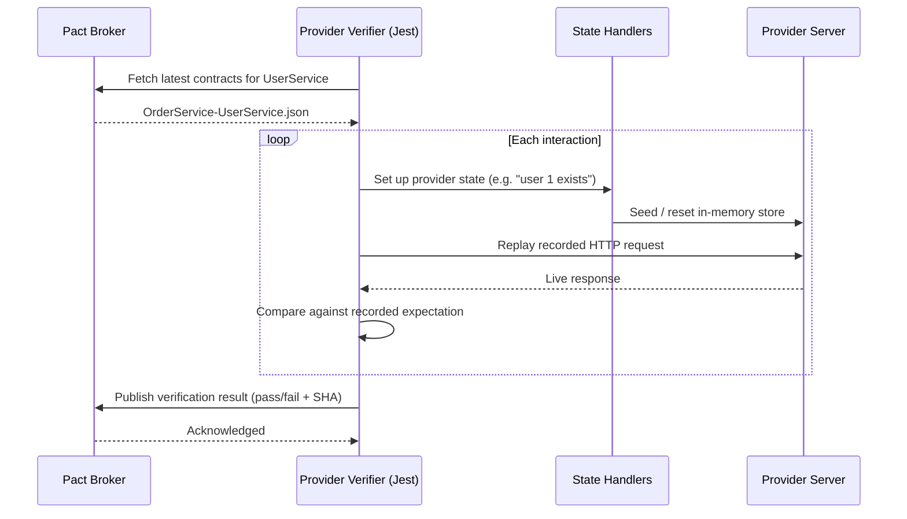
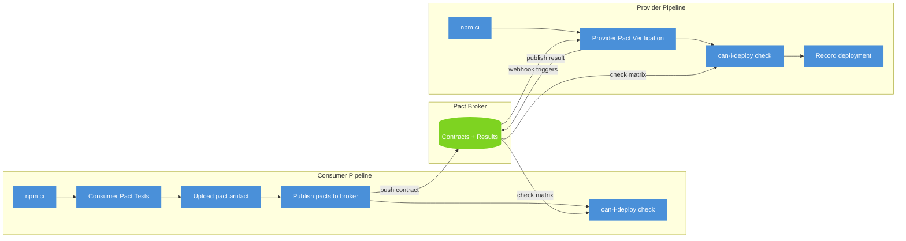

# Pact Contract Testing — Reference Implementation

As a SDET   — I own the full quality strategy for a 6-person development team. Integration failures between microservices were slipping through too late in our pipeline, so I introduced consumer-driven contract testing as the fix.
This repo is the production-ready reference implementation I built to prove the pattern: consumer tests, provider verification, Pact Broker, and can-i-deploy gates in CI. The kind of quality architecture decision I make in my day-to-day work

Consumer-driven contract testing with Pact.io — Order Service consumer, User Service provider, Pact Broker, and CI/CD with can-i-deploy gates

Consumer-driven contract testing with [Pact](https://docs.pact.io), covering:

- **Consumer** — Order Service (generates contracts)
- **Provider** — User Service (verifies contracts)
- **Pact Broker** — stores & manages contracts (local via Docker or PactFlow)
- **CI/CD** — GitHub Actions pipelines with `can-i-deploy` gates

---

## Architecture

### Overall contract flow



---

### Sequence: consumer generates a contract



---

### Sequence: provider verifies the contract



---

### CI pipeline overview



---

## Repository structure

```
pact-contract-testing/
├── consumer/                         # Order Service (generates contracts)
│   ├── src/
│   │   ├── userClient.js             # HTTP client for User Service
│   │   ├── userClient.pact.test.js   # Consumer pact tests → writes pacts/
│   │   └── publishPacts.js           # CLI script to push contracts to broker
│   ├── jest.config.js
│   └── package.json
│
├── provider/                         # User Service (verifies contracts)
│   ├── src/
│   │   ├── app.js                    # Express app (exported without binding)
│   │   ├── server.js                 # Binds app to a port (npm start)
│   │   └── routes/users.js           # User CRUD routes + in-memory store
│   ├── pact/
│   │   └── providerVerification.test.js  # Pact verifier + state handlers
│   ├── jest.config.js
│   └── package.json
│
├── pacts/                            # Generated contract files (gitignored)
│   └── OrderService-UserService.json
│
├── .github/
│   └── workflows/
│       ├── consumer-contract.yml     # Consumer: test → publish → can-i-deploy
│       └── provider-verification.yml # Provider: verify → can-i-deploy → record
│
├── docker-compose.yml                # Local Pact Broker (Postgres + broker UI)
├── .gitignore
└── README.md
```

---

## Quick start

### 1. Install dependencies

```bash
cd consumer && npm install && cd ..
cd provider && npm install && cd ..
```

### 2. Run consumer tests → generate contract

```bash
cd consumer
npm test
# ✓ Creates pacts/OrderService-UserService.json
```

### 3. Verify provider against the contract (local file mode)

```bash
cd provider
PACT_SOURCE=local npm test
# ✓ Provider verified against pacts/OrderService-UserService.json
```

### 4. (Optional) Start a local Pact Broker

```bash
docker compose up -d
# Broker UI → http://localhost:9292  (admin / admin)
```

Then publish and verify via the broker:

```bash
# Publish
cd consumer
PACT_BROKER_BASE_URL=http://localhost:9292 \
PACT_BROKER_TOKEN="" \
GITHUB_SHA=$(git rev-parse HEAD) \
GITHUB_REF_NAME=main \
npm run publish:pacts

# Verify
cd ../provider
PACT_BROKER_BASE_URL=http://localhost:9292 \
PACT_BROKER_TOKEN="" \
npm test
```

---

## CI setup

### Required GitHub Secrets

| Secret | Description |
|---|---|
| `PACT_BROKER_BASE_URL` | URL of your Pact Broker or PactFlow tenant |
| `PACT_BROKER_TOKEN` | Read/write API token |

### Workflow triggers

| Workflow | Trigger | What it does |
|---|---|---|
| `consumer-contract.yml` | Push/PR on `consumer/**` | Run consumer tests, publish pacts, `can-i-deploy` |
| `provider-verification.yml` | Push/PR on `provider/**` or broker webhook | Verify provider, `can-i-deploy`, record deployment |

### Pact Broker webhook (recommended)

Configure a "contract requiring verification published" webhook in your broker to `POST` a `repository_dispatch` event to GitHub. This ensures the provider pipeline runs automatically whenever a consumer publishes a new contract version — without any polling.

---

## Key concepts

| Concept | Description |
|---|---|
| **Consumer test** | Defines the minimum response shape the consumer needs using matchers (`like`, `eachLike`, `regex`). Generates a JSON contract. |
| **Provider state** | The `given()` clause in a consumer test. State handlers on the provider side set up the exact precondition before each interaction is replayed. |
| **Pact Broker** | Central store for contracts and verification results. Powers the deployment matrix. |
| **can-i-deploy** | CLI check that reads the deployment matrix to confirm all consumers of a provider (or vice versa) are verified before a deployment proceeds. |
| **WIP pacts** | "Work-in-progress" pacts from feature branches that the provider verifies without failing the build — allowing teams to develop in parallel. |

---

## Contract (sample)

`pacts/OrderService-UserService.json` (abbreviated):

```json
{
  "consumer": { "name": "OrderService" },
  "provider": { "name": "UserService" },
  "interactions": [
    {
      "description": "a GET request for user 1",
      "providerState": "user with ID 1 exists",
      "request": {
        "method": "GET",
        "path": "/users/1",
        "headers": { "Accept": "application/json" }
      },
      "response": {
        "status": 200,
        "body": {
          "id": 1,
          "name": "Alice",
          "email": "alice@example.com",
          "role": "admin"
        }
      }
    }
  ],
  "metadata": {
    "pactSpecification": { "version": "4.0" }
  }
}
```

---

## Extending the repo

- **Add a new consumer** — create a new folder, write pact tests pointing at the same broker, publish with a different consumer name.
- **Add a new interaction** — add a `.given().uponReceiving().withRequest().willRespondWith()` block in the consumer test, then add the matching state handler in `providerVerification.test.js`.
- **Use PactFlow** — replace `PACT_BROKER_BASE_URL` with your PactFlow URL; the rest of the setup is identical.
